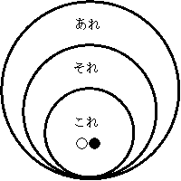
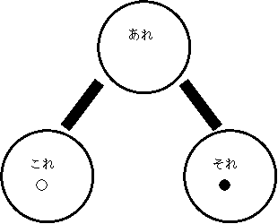

# 第 2 課

## 文型一覧

- これ／それ／あれは <物> です
- これ／それ／あれは〜ですか、〜ですか
- <内容> の <物> です（内容）
- <人> の <物> です（所有）
- これ／それ／あれは <人> のです
- この／その／あの <物> は <人> のです

## ❶ これ／それ／あれは <物> です

### ① 指示詞「これ／それ／あれ」

 図１  図２

○：話し手 ●：聞き手

これは時計です。  
それはカメラです。  
あれはテレビです。

### ② 疑問文「これは〇〇ですか」

これは本ですか。

𝟙 はい  
…はい、本です。  
…はい、そうです。

𝟚 いいえ  
…いいえ、本じゃありません。  
…いいえ、〇〇です。  
…いいえ、違います。

### ③「はい、そうです」

✦「そうです」という答えは、Ｎ文限定の答え。

𝟙 名詞文  
Q：あなたは学生ですか。  
A：○ はい、そうです。

𝟚 動詞文  
Q：昨日学校へ行きましたか。  
A：× <del>はい、そうです。</del>  
A：○ はい、行きました。

======

✧「はい、そうです」… 名詞の質問文（Ｎですか）に対して肯定するときに使います。動詞や形容詞の質問文（Ｖますか／Adj. ですか）に対する答えには使いません。動詞・形容詞の質問文には、その動詞・形容詞を使って答えます。

✧「いいえ、違います」… 名詞の質問文（Ｎですか）に対して否定するときに使います。動詞や形容詞の質問文（Ｖますか／Adj.ですか）に対する答えには使いません。動詞・形容詞の質問文には、その動詞・形容詞を使って答えます。

### ④ 疑問詞「何（なん）」

これは **何** ですか。  
…ボールペンです。

あれは **何** ですか。  
…パソコンです。

## ❷ これ／それ／あれは〜ですか、〜ですか

### ⓪ 選択疑問文

これは本ですか、雑誌ですか。  
…本です。

あれはパソコンですか、テレビですか。  
…テレビです。

## ❸ <内容> の <物> です（内容）

これは日本語の辞書です。  
これはかばんの雑誌です。  
それはパソコンの本です。  
それは車のかぎです。  
あれは銀行のカードです。

### ⓪ 疑問文「これは何の〇〇ですか」

これは何の雑誌ですか。  
…カメラの雑誌です。

それは何の本ですか。  
…日本語の本です。

あれは何の CD ですか。  
…英語の CD です。

## ❹ <人> の <物> です（所有）

これは田中さんのパソコンです。  
それはマリアさんの電話です。  
あれはキムさんの鞄です。

### ⓪ 疑問文「これはだれの〇〇ですか」

それはだれの電話ですか？  
…マリアさんの電話です。

それは誰のノートですか。  
…ワンさんのノートです。

## ❺ これ／それ／あれは <人> のです

✦ 所有する内容（物）が何であるか明白な場合は、省略が可能です。

これはわたしの本です。  
＝ これはわたしのです。

## ❻ この／その／あの <物> は <人> のです

✦「これ／それ／あれ」は **代名詞** です。  
✦「この／その／あの」は **連体詞** で名詞を修飾します。

これはわたしのペンです。  
＝ このペンはわたしのです。

### ⓪ 疑問文「この〇〇はだれのですか」

その時計はだれのですか。  
…ミラーさんのです。

あの本はだれのですか。  
…トムさんのです。
