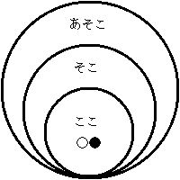
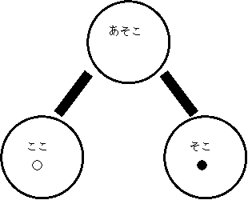

# 第 3 課

## 文型一覧

- ここは <場所> です
- <場所・物・人> はここです
- <場所・物・人> は <場所> です
- <場所・物・人> はこちらです
- <国・会社・学校> は〜です
- これは <国名・会社名> の <物> です（<国名・会社名> 製の～）
- ～はー円です

## ❶ ここは <場所> です

### ⓪ 指示詞「ここ／そこ／あそこ」

 図１  図２

○：話し手 ●：聞き手

ここは東京です。  
そこはトイレです。  
あそこは受付です。

## ❷ <場所・物・人> はここです

✦「Ｎ１はＮ２（場所）です」  
✦ この文型を用いて、物、場所、人などの存在する場所を表す。

𝟙 場所  
事務所はここです。  
トイレはそこです。  
受付はあそこです。

𝟚 物  
本はここです。  
時計はそこです。  
いすはあそこです。

𝟛 人  
先生はここです。  
トムさんはそこです。  
マリアさんはあそこです。

### ⓪ 疑問詞「どこ」

トイレは **どこ** ですか。  
…あそこです。

## ❸ <場所・物・人> は <場所> です

𝟙 場所  
学校は東京です。  
先生の家（いえ）は千葉（ちば）です。  
会議室は 3 階です。

𝟚 物  
ペンは教室です。  
事務所のカギは受付です。

𝟛 人  
マリアさんは事務所です。

### ⓪ 疑問文「〇〇はどこですか」

会議室はどこですか。  
…8 階です。

トニーさんの時計はどこですか。  
…受付です。

マイクさんはどこですか。  
…食堂です。

## ❹ <場所・物・人> はこちらです

✦「こちら／そちら／どちら」は方向を表す指示詞であるが、「ここ／そこ／あそこ」の代わりにも使われ、その場合、より丁寧な気持ちが表される。

エスカレーターはこちらです。  
トイレはそちらです。  
受付はあちらです。

マリアさんはそちらですか。  
…はい、そちらです。  
…いいえ、そちらじゃありません。あちらです。

### ⓪ 疑問詞「どちら」

✦「どこ」は場所、「どちら」は方向を尋ねる疑問詞である。場所を尋ねるのに、「どちら」を用いる場合もあり、その場合「どこ」を用いるより、丁寧な言い方になる。

会議室は **どちら** ですか。  
…あちらです。

ロビーは **どちら** ですか。  
…3 階です。

## ❺ <国・会社・学校> は〜です

𝟙 国  
わたしの国は日本です。  
カオサイさんのお国はタイです。

𝟚 会社  
カーンさんの会社はドイツ自動車です。

𝟛 学校  
マイクさんの大学は日本大学です。

======

✧「お国」… 接頭辞「お」は聞き手や第三者に関するものにつけて、聞き手や第三者に対する話し手の敬意を表す。

### ⓪ 疑問文「お国・会社・学校はどちらですか」

✦ 国・会社・学校など、所属する場所や組織の名前を尋ねる場合、疑問詞は「何」ではなく、「どこ／どちら」を用いる。

レベッカさんのお国は **どちら** ですか。  
…アメリカです。

シュルツさんの会社は **どちら** ですか。  
…シュコダ自動車です。

トニーさんの大学は **どちら** ですか。  
…シドニー大学です。

======

✦ 出身国、所属の会社、学校、大学を尋ねる疑問詞は「どこ」でもよいが、「みんなの日本語」は丁寧な形「どちら」になっている。  
✦「わたしのお国は～」と言ってしまう学生がいるので注意する。

======

✧「会社（大学）はどちらですか」の場合、① 会社（大学）の所在地と、② 会社（大学）名を尋ねる２種類があるが、「みんなの日本語」で扱う練習は ② の会社名（大学名）のみ。

会社はどちらですか。  
…IMC です（IMC で働いている）  
…大阪です（大阪にある）

## ❻ これは <国名・会社名> の <物> です（<国名・会社名> 製の～）

### ① 物の生産国、会社（メーカー）

𝟙 生産国  
これは日本の時計です。  
それはドイツの車です。  
あれはアメリカのパソコンです。

𝟚 会社  
これは SEIKO の時計です。  
それは BMW の車です。  
あれは IBM のパソコンです。

### ② 疑問文「どこの〇〇ですか」

これはどこの車ですか  
…イタリアの車です。  
…フェラーリの車です。

## ❼ ～はー円です

### ① 値段

この鉛筆は 50 円です。  
このノートは 100 円です。

### ② 疑問詞「いくら」

この時計は **いくら** ですか。  
…4300 円です。

## 追加

### ⓪ 日本語の指示詞

|  | 近称（こ） | 中称（そ） | 遠称（あ) | 不定称（ど） |
| :--: | :--------: | :--------: | :-------: | :----------: |
| 指示代名詞 | これ（複数：これら） | それ（複数：それら） | あれ（複数：あれら） | どれ |
| 指示代名詞（卑称） | こいつ | そいつ | あいつ | どいつ |
| 連体詞 | この | その | あの | どの |
| 場所 | ここ | そこ | あそこ | どこ |
| 方向 | こちら・こっち | そちら・そっち | あちら・あっち | どちら・どっち |
| 態様 | こう こんな | そう そんな | ああ あんな | どう どんな |
